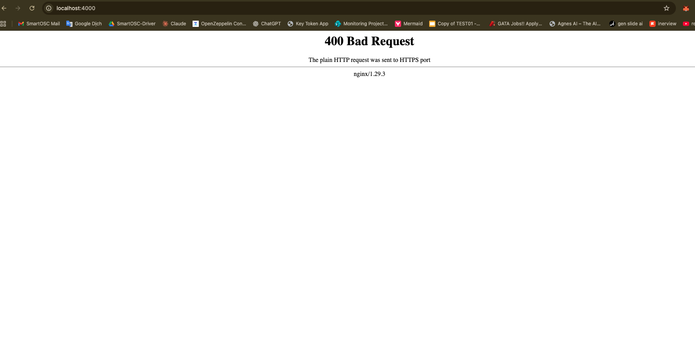

## RinChain: Private Go‑Ethereum (Clique PoA) + Blockscout

One‑command private chain with geth (Clique) and Blockscout explorer using Docker Compose.

### Requirements
- Docker Desktop (Compose v2)
- Bash

### First run
```bash
# 1) Create signer (writes keystore to geth/data and updates .env)
bash scripts/create_signer.sh

# 2) Build genesis from template (injects signer and allocs)
bash scripts/build_genesis.sh
docker compose -f /Users/user/Desktop/RinChain/compose.yaml restart nginx

# 3) Start all services


# Explorer (self‑signed TLS via nginx)
open https://localhost:4000   # accept the certificate

# RPC
# HTTP: http://localhost:8545
# WS:   ws://localhost:8546
```

### Prefunded accounts in genesis
- Signer is pre‑funded by default.
- This repo also funds `0x00000FC78106799b5b1dbD71f206d8f0218B28fe` with 100000 ETH.
  To change or add more, edit `geth/genesis.template.json` under `alloc` and rerun `bash scripts/build_genesis.sh`.

### Reset chain (apply new genesis/allocs)
```bash
docker compose down
rm -rf geth/data/* blockscout/postgres/*
bash scripts/build_genesis.sh
docker compose up -d
```

### Extract signer private key (for local testing only!)
```bash
docker run --rm -v $(pwd)/geth/data:/data python:3.12 bash -lc "\
  pip -q install eth-keyfile >/dev/null && python - <<'PY'\
import json, glob\nfrom eth_keyfile import decode_keyfile_json\n\nwith open('/data/password.txt','rb') as f: pw=f.read().strip()\nwith open(sorted(glob.glob('/data/keystore/*'))[0]) as fh: k=json.load(fh)\nprint(decode_keyfile_json(k, pw).hex())\nPY"
```

### Useful RPC checks
```bash
# current block number
printf '%s' '{"jsonrpc":"2.0","method":"eth_blockNumber","params":[],"id":1}' \
 | curl -s -H 'Content-Type: application/json' --data @- http://localhost:8545

# balance of funded address
printf '%s' '{"jsonrpc":"2.0","method":"eth_getBalance","params":["0x00000FC78106799b5b1dbD71f206d8f0218B28fe","latest"],"id":2}' \
 | curl -s -H 'Content-Type: application/json' --data @- http://localhost:8545
```

### Troubleshooting
- Explorer shows “0 blocks” after reset: indexing needs ~1–2 minutes. Refresh after a bit.
- Changed `alloc` but balances don’t show: reset both geth and Blockscout DB (see Reset section).
- Geth fails “password/key not found”: recreate `geth/password.txt` and signer with `bash scripts/create_signer.sh`, rebuild genesis, restart geth.

### Project layout
- `compose.yaml` — services: geth, postgres, redis, blockscout, frontend, nginx
- `geth/genesis.template.json` — template with placeholders; `scripts/build_genesis.sh` renders it
- `geth/data/` — datadir (git‑ignored)
- `nginx/` — HTTPS reverse proxy for Blockscout (self‑signed certs, git‑ignored)
- `.gitignore` — ignores local data, secrets, and build artefacts

This setup is for local development only (single validator, unlocked account, self‑signed TLS). Do not use in production.


# Rin-Chain-GoEthereum
